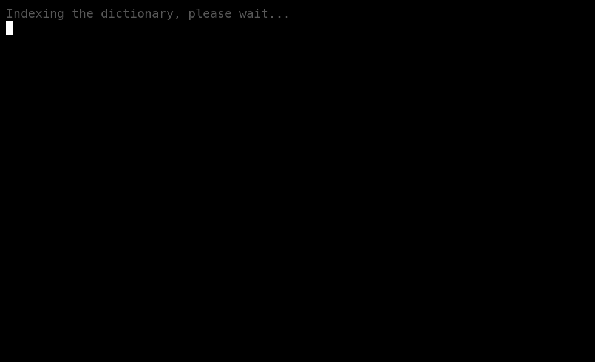

= Wordlet (AWK)

Wordlesque game implemented (mostly) in AWK

== Usage

....
$ git clone https://github.com/remi6397/wordlet.awk.git wordlet-awk
$ cd !$
....

....
$ ./wordlet.awk
- or -
$ awk -v dict=/usr/share/dict/words -f wordlet.awk
....
